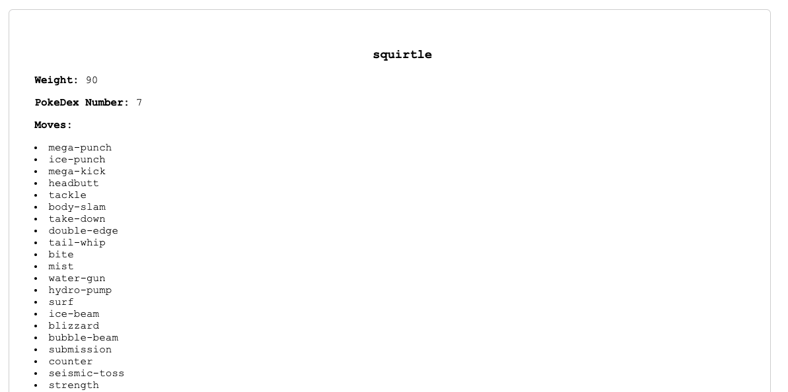

# Pokemon API Task

## Task Overview

### Goal
The goal of this task is to use the Pokemon API to fetch data and display it in a user-friendly format on a web page.

### Focus Area
- API Calls: Using the fetch() function to make requests to the Pokemon API.
- Parsing Results: Extracting useful information from the JSON responses.
- Displaying Data: Presenting the fetched data in a readable and visually appealing manner.

### Relevance
Understanding how to make API calls and handle responses is crucial for modern web development. APIs allow applications to communicate with each other, enabling the integration of different services and data sources.

## Installation Instructions
- Clone or download this folder of the git repository.
- Navigate to the folder on your machine.
- Open the HTML file in your browser.

Alternatively, go to this [website](https://html-preview.github.io/?url=https://github.com/juliapassenberger/codingTasks/blob/main/Pokemon%20API/pokemon.html) to see my page in action. 

## Usage
1. Open the HTML file or go to the above mentioned link.
2. Enter a name of a Pokemon into the search field.
   
4. Click 'Search' or 'Enter' to initiate the API call.
   
6. Look at the results for the Pokemon below the search field.
7. See if you can find the hidden egg when entering the name of a very specific pokemon.

## Credits
Developer: Julia Passenberger
