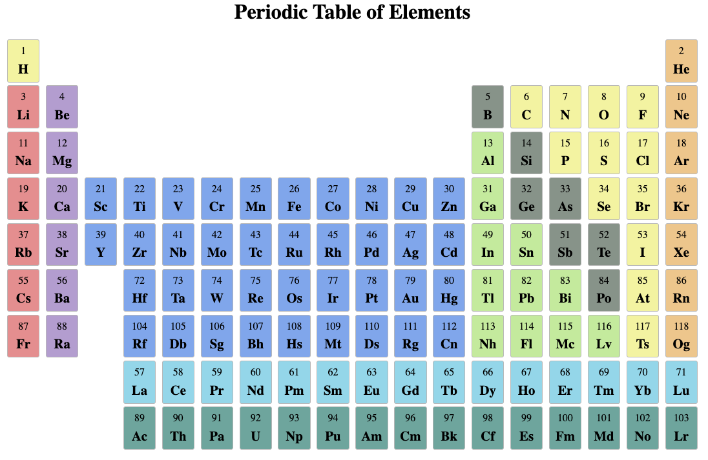
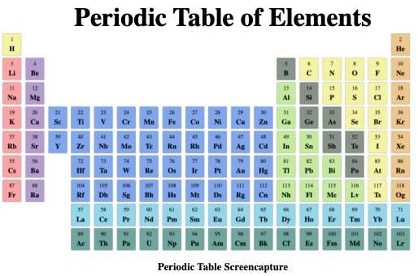

# Table of Elements Task

## Task Overview

### Goal
The goal of this task is to create a responsive table of elements. It focuses on responsive design using media queries to ensure the table adapts well to different screen sizes and devices.

### Focus Area
- Responsive Design: Utilizing media queries to make the table of elements adaptable to various screen sizes.
- Grid: Using a grid-layout to display the table elements.

### Relevance
esponsive design is a critical skill in web development, ensuring that websites and applications provide an optimal viewing experience across a wide range of devices. 

## Installation Instructions
- Clone or download this folder of the git repository.
- Navigate to the folder on your machine.
- Open the HTML file in your browser.

Alternatively, go to this [website](https://html-preview.github.io/?url=https://github.com/juliapassenberger/codingTasks/blob/main/Table%20of%20Elements/elements-grid.html) to see my page in action. 

## Usage
1. Open the HTML file or go to the above mentioned link.
2. Take a look at the table of elements and slowly size down your browser window.
3. The table will change the size of the divs as well as the font-size after a certain threshold.
   
5. Eventually an screenshot will be displayed instead of the html grid.
   

## Credits
Developer: Julia Passenberger
