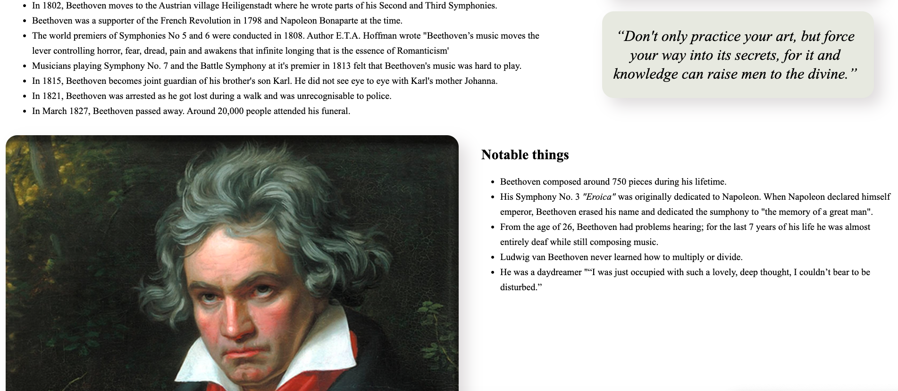

# Tribute Page Task

## Task Overview

### Goal
The goal of this task is to create a tribute page using HTML and CSS, incorporating different elements and styles.

### Focus Area
- HTML Elements: Using a variety of HTML tags to structure the content.
- CSS Styling: Applying CSS to style the page and make it visually appealing.

### Relevance
HTML and CSS are the foundational technologies for web development. Understanding how to use HTML to structure content and CSS to style it is essential for creating web pages. This project helps to build familiarity with these technologies through hands-on practice.

## Installation Instructions
- Clone or download this folder of the git repository.
- Navigate to the folder on your machine.
- Open the HTML file in your browser.

Alternatively, go to this [website](https://html-preview.github.io/?url=https://github.com/juliapassenberger/codingTasks/blob/main/Tribute%20Page/tribute.html) to see my page in action. 

## Usage
1. Open the HTML file or go to the above mentioned link.
2. Read through the page if you're interested in learning about Ludwig van Beethoven.   
   

## Credits
Developer: Julia Passenberger
