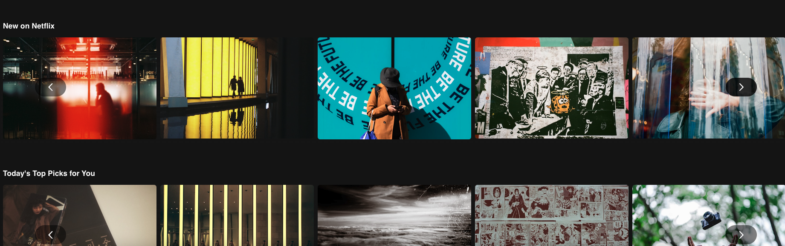

# Netflix Task

## Task Overview

### Goal
The goal of this task is to re-create a single page of an existing website (Netflix) using React, showcasing the ability to create functional components and utilize component libraries.

### Focus Area
- React Functional Components: Building the page using React functional components.
- Component Libraries and Icons: Integrating component libraries and icons to enhance the design and functionality.
- This project was bootstrapped with [Create React App](https://github.com/facebook/create-react-app).
- Limitations: Limited interactivty - links, pop-ups, hover-overs etc. were out of scope.

### Relevance
Learning React is essential for modern web development, as it is widely used in the industry. 

## Installation Instructions
- Clone or download this folder of the git repository.
- Navigate to the root folder on your machine.
- Open your terminal or command line and navigate to the netflix root folder.
- Install dependencies required for this application with 'npm install'.
- Use 'npm start' to run the app in the development mode.
- Open [http://localhost:3000](http://localhost:3000) to view the application in your browser.
- You can learn more about create-react-app in the [Create React App documentation](https://facebook.github.io/create-react-app/docs/getting-started).

Alternatively, click the following link to see the application deployed with Vercel [deployed with Vercel](https://netflix-lookalike-orcin.vercel.app).

## Usage
1. Open the application in your browser.
2. Explore the Netflix lookalike app.
   
4. Use the integrated carousel component to skip through images.
   
   

## Credits
Developer: Julia Passenberger

