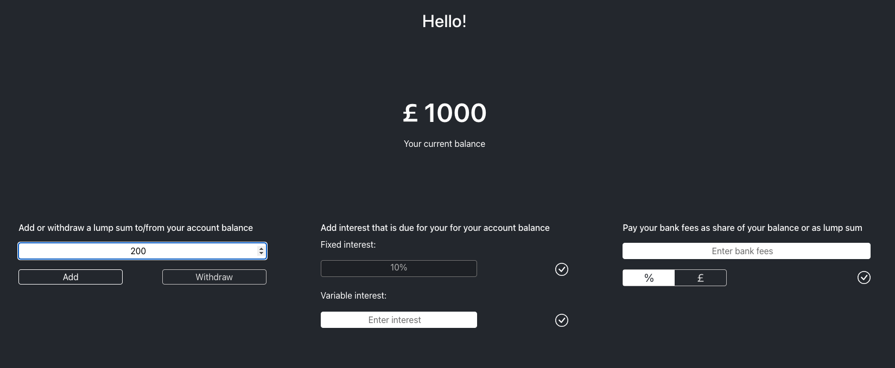

# Interest Calculator Task

## Task Overview

### Goal
The goal of this task is to create a web page that allows users to add and remove money from a fictional bank account.

### Focus Area
- State Management: Passing states between components in a React application to manage the bank account balance.
- Component Interaction: Ensuring smooth interaction between different components to reflect the changes in account balance.
- This project was bootstrapped with [Create React App](https://github.com/facebook/create-react-app).
- Limitations: Limited interactivty - extensive UX and UI design not in scope.

### Relevance
State management is a crucial aspect of React development, enabling developers to create dynamic and interactive applications. Understanding how to pass states between components is essential for building complex applications where different parts of the UI need to interact with each other.

## Installation Instructions
- Clone or download this folder of the git repository.
- Navigate to the root folder on your machine.
- Open your terminal or command line and navigate to the netflix root folder.
- Install dependencies required for this application with 'npm install'.
- Use 'npm start' to run the app in the development mode.
- Open [http://localhost:3000](http://localhost:3000) to view the application in your browser.
- You can learn more about create-react-app in the [Create React App documentation](https://facebook.github.io/create-react-app/docs/getting-started).

## Usage
1. Open the application in your browser.
2. Use the different input fields to add or remove money to/from the bank account.
4. Observe how the bank account balance changes as a result. 
   
   

## Credits
Developer: Julia Passenberger

