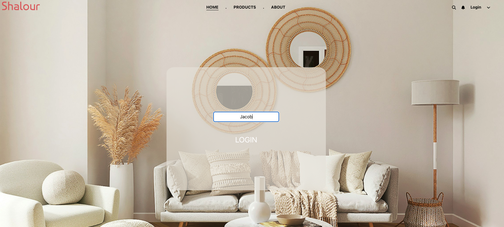

# Online Store Task

## Task Overview

### Goal
The goal of this task is to create an multi-page application that mimics an online shop with a limited number of functional elements, demonstrating proficiency in React and Bootstrap.

### Focus Area
- React Functional Components: Building the application using functional components in React.
- Routing: Implementing navigation between different pages of the application.
- State Management: Using useState, useRef, global state and local storage to manage the state of the application.
- Bootstrap Integration: Enhancing the visual appeal by integrating Bootstrap components.
- This project was bootstrapped with [Create React App](https://github.com/facebook/create-react-app).
- Limitations: Functionalities such as user authentication/authorization, specific functionalities of online stores are out of scope.

### Relevance
React is a powerful library for building dynamic user interfaces, and understanding state management is crucial for creating interactive applications. Using tools like useState, useRef, react global state, and local storage allows developers to manage the application state effectively. Integrating Bootstrap components helps in quickly building responsive and visually appealing interfaces.

## Installation Instructions
- Clone or download this folder of the git repository.
- Navigate to the root folder on your machine.
- Open your terminal or command line and navigate to the netflix root folder.
- Install dependencies required for this application with 'npm install'.
- Use 'npm start' to run the app in the development mode.
- Open [http://localhost:3000](http://localhost:3000) to view the application in your browser.
- You can learn more about create-react-app in the [Create React App documentation](https://facebook.github.io/create-react-app/docs/getting-started).

Alternatively, click the following link to see the application deployed with Vercel [deployed with Vercel](https://react-online-store-project.vercel.app).

## Usage
1. Open the application in your browser.
2. Explore the pages of the online store app.
3. On the 'Home' page, enter a name and observe how the component changes as a result (actual authentication is not implemented).
   
4. On the 'Products' page, use the drop-down options to change the colour of the drop-down writing. This information is managed with state variables and saved to local storage.
   
5. On the 'Products' page, use the 'Buy' button to add the price of the product to a total in the top-right corner across pages.
   

   

## Credits
Developer: Julia Passenberger

